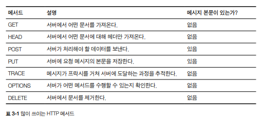
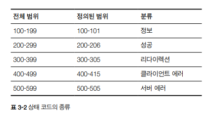

# CH03. HTTP 메시지

HTTP 메시지의 모든것(어떻게 메시지를 만들고 이해하는지)에 대해서…

- 메시지가 어떻게 흘러가는가
- HTTP메시지의 세 부분(시작줄, 헤더, 개체 본문)
- 요청과 응답 메시지의 차이
- 요청 메시지가 지원하는 여러 기능(메서드)들
- 응답 메시지가 반환하는 여러 상태 코드들
- 여러 HTTP 헤더들은 무슨 일을 하는가

## 3.1 메시지의 흐름

**HTTP 메시지** : HTTP 애플리케이션 간에 주고받은 데이터 블록들

- 데이터 블록 구조
    1. 텍스트 메타 정보 : 메시지의 내용, 의미 설명
    2. 데이터(선택) 

**메시지가 흐르는 곳**

- 클라이언트
- 서버
- 프락시

**메시지 방향**

- 인바운드
- 아웃바운드
- 업스트림
- 다운스트림

### 3.1.1 메시지는 원 서버 방향을 인바운드로 하여 송신

- 인바운드 : 메시지 → 원 서버
- 아웃바운드 : 모든 처리가 끝난 뒤 메시지 → 사용자 에이전트

### 3.1.2 다운스트림으로 흐르는 메시지

모든 메시지는 다운스트림으로 흐름.

## 3.2 메시지의 각 부분

**메시지 구성**

- 시작줄 : 어떤 메시지인지 서술
- 헤더 : 속성
- 본문 : 데이터

시작줄과 헤더는 줄 단위로 분리된 아스키 문자열.

각 줄은 캐리지 리턴, 개행 문자로 구성된 두 글자의 줄바꿈 문자열(CRLF)로 끝남.

### 3.2.1 메시지 문법

**요청 메시지** : 웹 서버에 어떤 동작을 요구

```
<메서드> <요청 URL> <버전>
<헤더>

<엔터티 본문>
```

**응답 메시지** : 요청 결과를 클라이언트에게 돌려줌

```
<버전> <상태코드> <사유 구절>
<헤더>

<엔터티 본문>
```

| 메서드 | 클라이언트 측에서 서버가 리소스에 대해 수행해주길 바라는 동작 |
| --- | --- |
| 요청 URL | 요청 대상이 되는 리소스를 지칭. 완전한 URL/URL의 경로 구성요소 |
| 버전 | 메시지에서 아용 중인 HTTP 버전. 형식 HTTP/<메이저>.<마이너> |
| 상태 코드 | 요청 중에 무엇이 일어났는지 설명하는 세 자리 숫자 |
| 사유 구절 | 상태 코드 의미를 설명해주는 문구. 상태 코드 이후부터 줄바꿈 문자열까지 |
| 헤더들 | 이름, 콜론(:), 선택적인 공백, 값, CRLF가 순서대로 나타나는 헤더. 헤더 복록이 빈 줄로 끝나 헤더 목록의 끝과 엔터티 본문의 시작을 표시함 |
| 엔터티 본문 | 임의의 데이터 블록 포함. 헤너나 엔터티 본문이 없어도 HTTP 헤더 집합은 항상 빈줄로 끝남 |


## 3.2.2 시작줄

- 요청 메시지 : 무엇을 해야할지?
- 응답 메시지 : 무슨 일이 일어났는지?

**요청줄**

메서드 + URL : 서버에서 어떤 동작이 일어나야 하는지 설명해주는 메서드 + 그동작에 대한 대상을 지칭하는 요청  URL

클라이언트가 어떤 HTTP 버전으로 말하고 있는지 서버에게 알려주는 HTTP 버전도 포함

모든 필드는 공백으로 구분

예) 그림 3-5 
`GET /test/hi-there.txt HTTP/1.1` → GET(요청 메서드) /test/hi-there.txt(요청 URL) HTTP/1.1(버전)

**응답줄**

수행 결과에 대한 상태 정보와 결과 데이터를 클라이언트에게 돌려준다.

응답 메시지에 쓰인 HTTP 버전, 숫자로 된 상태 코드, 수행 상태에 대해 설명해주는 텍스트로 된 사유 구절이 들어있음.

모든 필드는 공백으로 구분

예) 그림 3-5

`HTTP/1.0 200 OK` → HTTP/1.0(HTTP 버전) 200(상태코드) OK(사유 구절)

**메서드**

요청의 시작줄은 메서드로 시작하며, 서버에게 무엇을 해야 하는지 말해준다.

HTTP 명세는 공통 요청 메서드의 집합을 정의.



모든 서버가 해당 메서드를 모두 구현한 것은 아님. HTTP는 쉽게 확장할 수 있도록 설계되었기 때문에, 다른 서버는 그들만의 메서드를 추가로 구현했을 수도 있음.

이런 추가 메서드는 HTTP 명세를 확장하는 것이기 때문에 확장 메서드라고 불림.

**상태 코드**

클라이언트에게 무엇이 일어났는지 말해줌. 각 응답 메시지의 시작줄에 담겨 반환됨.

숫자로 된 코드 + 문자열로 되어 있음.



상태 코드를 추가로 정의하게 된다면, 일반적인 범주로 정의해야한다.
예) 515번을 새로 정의할 때, 서버 에러를 의미하는 것으로 간주하고 정의해야한다.

**사유 구절**

응답 시작줄의 마지막 구성요소. 상태 코드에 대한 글로된 설명.

상태 코드와 일대일로 대응됨. 애플리케이션 개발자들이 그들의 사용장게 요청 중에 무슨 일이 일어났는지 알려주기 위해 넘겨줄 수 있는,  상태 코드의 사람이 이해하기 쉬운 버전이다.

**버전 번호**

`HTTP/x.y` 형식으로 요청과 응답 메시지 양쪽 모두 기술됨. 자신이 따르는 프로토콜 버전을 상대방에게 말해주기 위한 수단.

### 3.2.3 헤더

시작줄 다음에는 0개, 1개 혹은 여러 개의 HTTP 헤더가 옴.

HTTP 헤더 필드는 요청과 응답 메시지에 추가 정보를 더함. 이름/값 쌍 목록

**헤더 분류**

HTTP 헤더 명세는 여러 헤더 필드를 정의함.

- 일반 헤더 : 요청과 응답 양쪽에 모두 나타날 수 있음.
- 요청 헤더 : 요청에 대한 부가 정보 제공
- 응답 헤더 : 응답에 대한 부가 정보 제공
- Entity 헤더 : 본문 크기와 콘텐츠, 리소스 그 자체를 서술
- 확장 헤더 : 명세에 정의되지 않은 새로운 헤더

각 HTTP 헤더 문법 - 이름, 쉼표, (공백), 필드 값, CRLF 순서대로 나열

**헤더를 여러 줄로 나누기**

긴 헤더 줄 → 여러 줄로 쪼개기 : 추가 줄 앞에 최소 스페이스 하나 or 탭 문자

### 3.2.4 엔터티 본문

선택적인 부분. HTTP 메시지의 화물이라고 할 수 있음.

이미지, 비디오, HTML 문서, 소프트웨어 애플리케이션, 신용카드 트랜잭션, 전자우편 등 디지털 데이터 나름.

### 3.2.5 버전 0.9 메시지

버전 0.9는 HTTP 프로토콜의 초기 버전.

요청과 응답으로 이루어짐.

요청 : 메서드 + 요청 URL

응답 : 엔터티로만 구성

## 3.3 메서드

### 3.3.1 안전한 메서드(Safe Method)

HTTP는 안전한 메서드라 불리는 메서드의 집합을 정의. 해당 메서드를 사용하는 HTTP 요청의 결과로 서버에 어떤 작용도 없음을 의미. (HTTP 요청 결과로 인해 서버에서 일어나는 일이 아무것도 없다는 의미)

안전한 메서드가 서버에 작용을 유발하지 않는다는 보장은 없음. (개발자 재량) → 안전한 메서드 목적 : 서버에 어떤 영향을 줄 수 있는 안전하지 않은 메서드가 사용될 때 사용자들에게 그 사실을 알려주는 HTTP 애플리케이션을 만들 수 있도록 하는 것.

### 3.3.2 GET

서버에게 리소스를 달라고 요청하기 위해 사용.

HTTP/1.1 필수 구현


### 3.3.3 HEAD

GET처럼 행동하지만, 서버는 응답으로 헤더만 돌려줌. 엔터티 본문은 반환되지 않음.

- 리소스를 가져오지 않고 정보(타입 등)를 알 수 있음.
- 상태 코드를 통해, 개체가 존재하는지 확인할 수 있음.
- 헤더를 확인 → 리소스 변경 검사

⇒ GET으로 얻는 헤더와 HEAD로 얻는 헤더가 같도록 보장해야함.

HTTP/1.1 필수 구현


### 3.3.4 PUT

서버에 문서를 쓰기 위해 사용.

서버 : 요청 본문 → 요청 URL 이름대로 새 문서 만들거나, 교체

PUT은 콘텐츠를 변경할 수 있게 해주기 때문에, 많은 웹 서버가 PUT을 수행하기 전에 사용자에게 비밀번호를 입력해서 로그인을 하도록 요구함.

### 3.3.5 POST

서버에 입력 데이터를 전송하기 위해 설계. 주로 HTML 폼을 지원하기 위해 사용됨.

폼 데이터 → 서버 전송 → 필요한 곳(게이트웨이 등)에 보냄.


### 3.3.6 TRACE

클라이언트가 어떤 요청을 할 때, 그 요청은 방화벽, 프락시, 게이트웨이 등의 애플리케이션을 통과할 수 있음. TRACE 메서드는 클라이언트에게 자신의 요청이 서버에 도달했을 때 어떻게 되는지 알려줌.

TRACE 요청은 목적지 서버에서 ‘루프백’ 진단을 시작. 요청 전송 마지막 단계에 있는 서버는 자신이 받은 요청 메시지를 본문에 넣어 TRACE 응답을 되돌려줌. 클라이언트는 자신과 목적지 서버 사이에 있는 모든 HTTP 애플리케이션의 요청/응답 연쇄를 따라가면서 자신이 보낸 메시지가 망가졌거나 수정되었는지, 만약 그렇다면 어떻게 변경되었는지 확인할 수 있음.

주로 진단을 위해 사용됨. 프락시나 다른 애플리케이션들이 요청에 어떤 영향을 미치는지 확인해보고자 할 때도 사용.

진단을 위해 사용할 때는 괜찮지만, 그 대신 중간 애플리케이션이 여러 다른 종류의 요청(GET, HEAD, POST 등)들을 일관되게 다룬다고 가정하는 문제가 있음. 많은 HTTP 애플리케이션은 메서드에 따라 다르게 동작함.

TRACE 요청은 어떠한 엔터티 본문도 보낼 수 없음. 응답의 엔터티 본문에는 서버가 받은 요청이 그대로 들어있음.


### 3.3.7 OPTIONS

웹 서버에 여러 가지 종류의 지원 범위에 대해 물어봄.

ex) 지원 메서드 목록


### 3.3.8 DELETE

서버에게 요청한 URL로 지정한 리소스 삭제할 것 요청.

클라이언트 : 삭제가 수행되는 것을 보장 x. (HTTP 명세는 클라이언트에게 알리지 않고 요청을 무시하는 것을 허용함.)


### 3.3.9 확장 메서드

새로운 기능 추가.

모든 확장 메서드가 형식을 갖춘 명세로 정의된 것은 아니라는 점 주의 필요.

## 3.4 상태 코드

상태 코드는 클라이언트에게 트랜잭션을 이해할 수 있는 쉬운 방법을 제공.

### 3.4.1 100-199 : 정보성 상태 코드

| 상태코드 | 사유 구절 | 의미 |
| --- | --- | --- |
| 100 | Continue | 요청의 시작 부분 일부가 받아들여졌으며, 클라이언트는 나머지를 계속 이어서 보내야함을 의미. 이 후, 서버는 반드시 요청을 받아 응답해야함. |
| 101 | Switching Protocols | 클라이언트가 Upgrade 헤더에 나열한 것 중 하나로 서버가 포로토콜을 바꾸었음을 의미. |

*100 Continue : HTTP 클라이언트 애플리케이션이 서버에 엔터티 본문을 전송하기 전에 그 엔터티 본문을 서버가 받아들일 것인지 확인하려고 할 때, 그 확인 작업을 최적화하기 위한 의도로 도입됨.

**클라이언트 + 100 Continue**

클라이언트가 100 Continue 응답을 기다리겠다면, 100-continue로 하는 Expect 요청 헤더를 보내야함.

클라이언트 애플리케이션은 100-continue를 서버가 다루거나 사용할 수 없는 큰 엔터티를 서버에게 보내지 않으려는 목적으로만 사용해야 함.

Expect 헤더를 보낸 클라이언트는 서버 100 응답을 타임아웃을 두고 기다린후에 그냥 엔터티를 보내야함.

**서버 + 100 Continue**

서버가 100-continue 값이 담긴 Expect 헤더가 포함된 요청을 받으면, 100 Continue 응답 혹은 에러 코드로 답해야함. 100-continue 응답을 의도하지 않은 클라이언트에게 100 상태 코드를 보내면 안됨.

100번 응답 보내기 전에 이미 엔터티 수신하면 응답 보낼 필요 없음.

서버가 100번 응답을 받을 것을 의도한 요청을 받고 난 상태에서 엔터티 본문을 읽기 전에 요청을 끝내기로 결정했다면, 서버는 그냥 응답을 보내고 연결을 닫으면 안됨. : 클라이언트가 응답을 받을 수 없게 되기 때문(4장 참고)

**프락시 + 100 Continue**

프락시 할 일

- HTTP/1.1을 따르거나 어떤 버전인지 모를 때 : Expect 헤더 포함시켜 요청을 다음으로 전달
- 1.1 이전 버전 HTTP 일 때 : 417 Expectation Failed 에러 응답
- 만약 1.0이나 이전 버전 클라이언트를 대신해 Expect 헤더와 100-continue값을 요청에 포함시키기로 결정했다면, 프락시는 100 Continue 응답을 클라이언트에 전달하면 안됨. (클라이언트는 100 응답을 모름)

### 3.4.2 200-299 : 성공 상태 코드

| 상태코드 | 사유 구절 | 의미 |
| --- | --- | --- |
| 200 | OK | 정상 요청, 엔터티 본문은 요청된 리소스 포함. |
| 201 | Created | 서버 개체 생성하라는 요청을 위한 것. 응답 엔터티 본문 : 생성된 리소스에 대한 참조 Location 헤더, 그 리소스를 참조할 수 있는 여러 URL. 서버는 상태 코드 보내기 전에 객체를 생성해야함. |
| 202 | Accepted | 요청은 받아들여졌지만 서버는 아직 동작 수행하지 않음. 서버가 요청 처리 완료할지에 대한 보장 없음. ”요청이 받아들이기에 적법하다”는 의미 뿐. 엔터티 본문에 요청에 대한 상태, 요청의 처리 완료 추정 포함해주기 |
| 203 | Non-Authoritative Information | 엔터티 헤더에 들어있는 정보가 원래 서버 x 리소스의 사본에서 옴. 중개자 리소스 사본 갖고 있지만, 리소스에 대한 메타 정보를 검증하지 못한 경우 |
| 204 | No Content | 응답 메시지 : 헤더, 상태줄 o / 엔터티 본문 x. 주로 웹브라우저를 새 문서로 이동시키지 않고 갱신하고자 할 때 사용 |
| 205 | Reset Content | 주로 브라우저를 위해 사용되는 또 하나의 코드. 브라우저에게 현재 페이지에 있는 HTML 폼에 채워진 모든 값을 비우라고 말함. |
| 206 | Partial Content | 부분 혹은 범위 요청이 성공. 206 응답은 Content-Rage, Data 헤더를 반드시 포함, Etag와 Content-Location 중 하나 헤더도 반드시 포함. |

### 3.4.3 300-399 : 리다이렉션 상태 코드

클라이언트가 관심있어 하는 리소스에 대해 다른 위치를 사용하라고 말해주거나 그 리소스 내용 대신 다른 대안 응답을 먼저 제공.

### 3.4.4 400-499 : 클라이언트 에러 상태 코드

### 3.4.5 500-599 : 서버 에러 상태 코드

## 3.5 헤더
